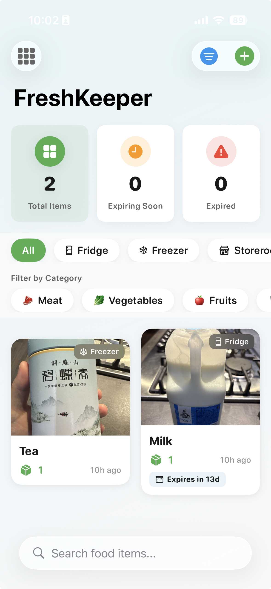

# 🥬 FreshKeeper

> Never let food go to waste again! A beautiful iOS app for smart food inventory management.




## ✨ Features

### 📸 Visual Inventory at a Glance
Track your food with photos and see everything in a beautiful grid layout

### ⏰ Smart Expiry Tracking
Color-coded alerts show what's expiring soon - never waste food again

### 📍 Multiple Storage Locations
Organize by Fridge, Freezer, Pantry, or create custom locations

### 📦 Quick Stock Management
Update quantities with a tap, auto-delete at zero

### 🔍 Instant Search & Filters
Find what you need in seconds with powerful filtering

### 🔒 100% Private
All data stays on your device - no cloud, no tracking

## 🚀 Quick Start

### Prerequisites
- macOS 14.0+ with [Xcode 15.0+](https://apps.apple.com/app/xcode/id497799835)
- iPhone with iOS 17.0+ or Simulator
- Free Apple ID (no paid developer account needed)

### Installation

**1️⃣ Clone & Open**
```bash
git clone https://github.com/dsflu/food-manager.git
cd food-manager
open FreshKeeper/FreshKeeper.xcodeproj
```

**2️⃣ Select Your Device**
- In Xcode, choose your iPhone or a simulator from the device menu
- If using your iPhone, connect it via USB and trust the computer

**3️⃣ Run the App**
- Press **⌘R** or click the ▶️ button
- First time? Xcode will automatically set up code signing
- The app launches with default storage locations ready to use!

## 📱 How to Use

### Add Your First Item
1. Tap the **+** button
2. Snap a photo (optional)
3. Enter name and quantity
4. Set expiry date with quick shortcuts
5. Tap "Add to Inventory"

### Stay Organized
- **Filter by location**: Tap "Fridge" or "Freezer" chips
- **Search**: Pull down to reveal the search bar
- **Update quantities**: Tap any item and use +/- buttons
- **Custom categories**: Create your own with emojis!

### Track Expiry Dates
- 🔴 **Red badge** = Expired
- 🟠 **Orange badge** = Expires within 3 days
- 🔵 **Blue badge** = Fresh

## 🏗️ Built With

- **SwiftUI** - Modern declarative UI
- **SwiftData** - Efficient local persistence
- **iOS 17+** - Latest Apple technologies
- **100% Swift** - Type-safe and performant

## 🧪 Testing Checklist

Before shipping, test these key flows:
- [ ] Add items with/without photos
- [ ] Set different expiry dates
- [ ] Update quantities to zero
- [ ] Search and filter items
- [ ] Create custom categories
- [ ] Delete items

## ⚡ Performance Tips

### Debug vs Release Mode
The app runs **10-50x slower** in Debug mode! For testing and demos, always use Release mode:

1. In Xcode: **Product → Scheme → Edit Scheme**
2. Select **Run** → **Build Configuration**
3. Change from **Debug** to **Release**
4. Press **⌘R** to rebuild

### Quick Performance Wins
- **Release mode**: Essential for real-world testing
- **100+ items**: App handles large inventories smoothly
- **Image optimization**: Photos auto-compressed to ~200KB
- **Efficient scrolling**: LazyVGrid renders only visible items

For detailed performance optimization, see [PERFORMANCE.md](PERFORMANCE.md)

## 🐛 Troubleshooting

| Issue | Solution |
|-------|----------|
| **"Persistent store migration error"** | Delete app and reinstall (happens after database updates) |
| **Camera not working** | Grant permissions: Settings → FreshKeeper → Camera |
| **App crashes on launch** | Clean build folder: Product → Clean Build Folder (⌘⇧K) |

## 🤝 Contributing

1. Fork the repository
2. Create your feature branch (`git checkout -b feature/AmazingFeature`)
3. Commit changes (`git commit -m 'Add some AmazingFeature'`)
4. Push to branch (`git push origin feature/AmazingFeature`)
5. Open a Pull Request

## 📄 License

MIT License - see [LICENSE](LICENSE) file for details

## 🙏 Acknowledgments

Built with ❤️ to reduce food waste and save money. Special thanks to:
- The SwiftUI team for the amazing framework
- Our beta testers for valuable feedback
- You, for helping reduce food waste!

---

**Ready to transform your food management?** Clone, build, and never waste food again! 🎉

<p align="center">
  <a href="https://github.com/dsflu/food-manager/issues">Report Bug</a>
  ·
  <a href="https://github.com/dsflu/food-manager/issues">Request Feature</a>
</p>